# Lightcone

```text
   __ _       _     _
  / /(_) __ _| |__ | |_ ___ ___  _ __   ___
 / / | |/ _` | '_ \| __/ __/ _ \| '_ \ / _ \
/ /__| | (_| | | | | || (_| (_) | | | |  __/
\____/_|\__, |_| |_|\__\___\___/|_| |_|\___|
        |___/
```

[](https://www.rust-lang.org)
[](https://github.com/quinn-rs/quinn)
[](LICENSE)
[](CONTRIBUTING.md)

> "Simultaneity is an illusion." — Albert Einstein

Lightcone (formerly Minkowski-KV) is a relativistic distributed database that enforces causal consistency using the speed of light.

In high-latency networks (interplanetary communication, mesh networks), wall-clock synchronization (NTP) is physically impossible. Standard consensus algorithms (Raft, Paxos) fight latency. Lightcone embraces it.

We use the Minkowski spacetime interval ($s^2$) to determine causality. If an event physically could not have reached you yet, it hasn't happened.

## 🌌 The Physics: Why Time is Broken

In classical systems, we assume a universal "now". But in Special Relativity, simultaneity depends on the observer.

If Earth and Mars are separated by 12 light-minutes:

- Event A happens on Earth at `t=0`.
- Event B happens on Mars at `t=1`.

Are they simultaneous? It's undefined. Information about A hasn't reached Mars yet.

To solve this without a central clock, Lightcone uses the Minkowski spacetime interval ($s^2$) as the ground truth for causality:

$$
s^2 = c^2\Delta t^2 - \Delta x^2 - \Delta y^2 - \Delta z^2
$$

- **Timelike ($s^2 > 0$):** Information could have traveled between events. We enforce ordering.
- **Spacelike ($s^2 < 0$):** Events are physically disconnected. We handle them as concurrent branches in a DAG.

## ⚡ Simulated Terminal Output

Lightcone includes a TUI simulation. Below is a capture of Earth sending a write to Mars.

The system calculates the distance and enforces a physics-based delay of exactly 3 seconds (simulated $c=100$).

```text
Diff
  (0,0)                           (300,0)
  ----------------------------------------------------------------
  > SET coordinates "Sector 7"
+ Write initiated. Hash: 0x8f3a...
+ Emitting signal via QUIC stream...

                                               (Signal traveling...)
                                               (Signal traveling...)

- Mars: Packet received at Network Layer.
- Physics Gate: Spacelike interval detected!
- Action: BUFFERING. Event is in the "Future".
...
+ Physics Gate: s² > 0 (Timelike). Releasing to App.
+ Mars DAG updated: Earth (0x8f3a) -> Local Head.
  > GET coordinates "Sector 7"
```

## 📐 Architecture

Lightcone sits between the transport layer and the application state. The Physics Gate is the arbiter of reality.

```mermaid
flowchart LR
		subgraph Network Layer
				A[Quinn Receiver] -->|QUIC Stream| B
		end
		subgraph "The Physics Gate"
				B{Calculate s²} -->|Spacelike s² < 0| D[Buffer]
				B -->|Timelike s² > 0| E[Event Horizon]
				D -->|Wait for Light| E
		end
		subgraph Application
				E --> F[Update DAG]
				F --> G[Commit State]
		end
		style B fill:#bbf,stroke:#333,stroke-width:2px
		style D fill:#f96,stroke:#333,stroke-width:2px,stroke-dasharray: 5 5
```



## 🚀 Quick Start

Lightcone comes with a simulation demo. We simulate the speed of light as `c=100` units/sec.

### 1) Prerequisites

- Rust 1.75+
- Cargo

### 2) Run the Simulation

Open two terminal windows.

**Terminal 1: Earth (Coordinates: 0, 0)**

```bash
# Earth node on port 5000
cargo run -- 5000
```

**Terminal 2: Mars (Coordinates: 300, 0)**

```bash
# Distance = 300 units. At c=100, latency is 3 seconds.
cargo run -- 5001
```

Type into the Earth terminal. Watch the Mars terminal wait exactly 3 seconds before acknowledging the reality of the message.

## 🛠 Tech Stack & Why Rust?

- **Async/Await (Tokio):** We simulate thousands of concurrent "light rays" (packets). Rust's zero-cost async state machines allow us to handle this without OS thread overhead.
- **Quinn (QUIC):** In deep space, TCP's head-of-line blocking is fatal. QUIC allows independent streams for each causal chain.
- **Petgraph:** We maintain a complex CRDT DAG. Rust's ownership model prevents cycle-induced memory leaks at compile time.
- **Ratatui:** A beautiful, GPU-accelerated TUI to visualize the Event Horizon.

## 📜 License

Distributed under the MIT License. See [LICENSE](LICENSE) for more information.

Built for the interplanetary internet.
